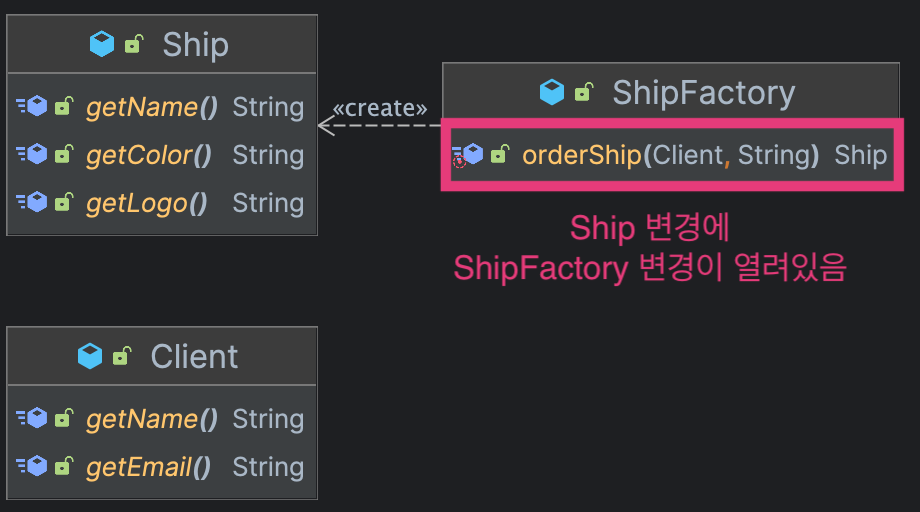
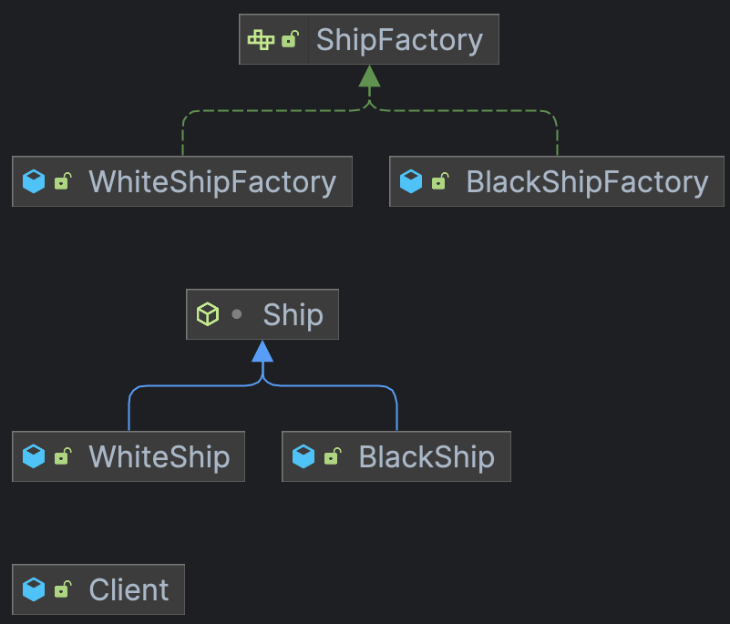

## Why to use
- 클라이언트가 **특정 클래스의 생성 방법을 모른 체로** 사용할 수 있게하고 OCP 를 지키며 클래스 종류를 쉽게 확장할 수 있게 하기위함.

### Example


#### Client.java
```java
@Getter
public class Client {
    private String name;
    private String email;
    public Client(String name, String email) {
        this.name = name;
        this.email = email;
    }
}
```

#### Ship.java
```java
@Getter
public class Ship {
    private String name;
    private String color;
    private String logo;

    public Ship(String name) {
        this.name = name;
    }

    public Ship(String name, String color, String logo) {
        this.name = name;
        this.color = color;
        this.logo = logo;
    }
}
```
### ShipFactory.java
```java
public class ShipFactory {

    public static Ship orderShip(Client client, String shipName) {
        if (client.getName() == null) {
            throw new MissingFormatArgumentException("주문 고객명을 입력해주세요");
        } else if (client.getEmail() == null) {
            throw new MissingFormatArgumentException("이메일을 입력해주세요");
        }

        // highlight-start
        // 💡 Ship 의 종류나 속성이 변경된다면?
        // 아래 코드가 변경될 수 밖에 없다.
        // 이는 Open-Closed Principal (OCP) 에 위배된다.
        // 확장에 열려있고, 변경에 닫혀있어야하는데
        // 확장과 변경 모두 열려있다.
        if (shipName == "white-ship") {
            // ~~
        } else if (shipName == "black-ship") {

        } else {
            throw new IllegalArgumentException("유효하지 않은 배 이름입니다.");
        }
        // highlight-end
        return new Ship(shipName);
    }
}
```
위의 코드는 OCP 에 위반한다.

> 팩토리 메소드 패턴은 클래스 변경에 독립적인 클래스 생성을 위해 필요하다. <br></br>
다양한 구현체가 존재하고, 그중에 특정 구현체를 만들 수 있는 다양한 팩토리를 제공하는 패턴 <br></br>
👉 **팩토리 패턴은 위 예제에서 ShipFactory 클래스를 확장함으로써 다양한 Ship 을 커버할 수 있게한다.**

## When to use
- **특정 클래스를 생성하는 방식을 OCP 원칙을 지키며 변화에 독립적으로 확장하고 싶을 때**
- 특정 클래스의 상태 관리를 `static` 키워드 없이 하고 싶을 때


## How to use


Factory 를 Interface 및 구현체
추상 클래스 - 클래스 간 계층 구조를 갖게 하는게 일반적


#### Ship.java
여기서는 Interface 대신 Abstract class 를 사용했다.
```java
@Getter
abstract class Ship {
    private String name;
    private String color;
    private String logo;

    protected Ship(String name) {
        this.name = name;
    }

    protected Ship(String name, String color, String logo) {
        this.name = name;
        this.color = color;
        this.logo = logo;
    }

    void changeShipInfo(String name, String color, String logo) {
        this.name = name;
        this.color = color;
        this.logo = logo;
    }
}
```
#### WhiteShip.java
```java
public class WhiteShip extends Ship {
    protected WhiteShip(String name, String color, String logo) {
        super(name, color, logo);
    }
}
```
#### BlackShip.java
```java
public class BlackShip extends Ship {
    protected BlackShip(String name, String color, String logo) {
        super(name, color, logo);
    }
}
```

> WhiteShip, BlackShip 등 기존 코드 변경에 무관하게 <br></br>
클래스를 확장시킬 수 있다. <br></br>
⚠️ **이 때, 클래스 확장시마다 각각 Factory 를 구성해야한다.**

#### ShipFactory.java
```java
public interface ShipFactory {

    default Ship orderShip(Client client, String orderShipName) {
        validateClient(client);
        validateShipName(orderShipName);
        Ship ship = createShip();
        sendEmailToClient(client.getEmail(), ship);

        return ship;
    }

    Ship createShip();

    private void validateClient(Client client) {
        if (client.getName() == null || client.getName().isBlank()) {
            throw new IllegalArgumentException("주문 고객 이름을 입력해주세요");
        }
        if (client.getEmail() == null || client.getEmail().isBlank()) {
            throw new IllegalArgumentException("주문 고객 이메일을 입력해주세요");
        }
    }

    private void validateShipName(String orderShipName) {
        if (orderShipName.equalsIgnoreCase("white-ship")) {

        } else if (orderShipName.equalsIgnoreCase("black-ship")) {

        } else {
            throw new IllegalArgumentException("주문할 수 없는 배압니다.");
        }
    }

    private void sendEmailToClient(String clientEmail, Ship ship) {
        System.out.println(clientEmail + "로 주문 정보 발송되었습니다.");
    }
}
```

#### WhiteShipFactory.java
```java
public class WhiteShipFactory implements ShipFactory {
    // orderShip 은 default 메소드라 따로 구현 필요 X
    @Override
    public WhiteShip createShip() {
        return new WhiteShip("white-ship", "white", "⇯");
    }
}
```

#### BlackShipFactory.java
```java
public class BlackShipFactory implements ShipFactory {
    @Override
    public Ship createShip() {
        return new BlackShip("black-ship", "black", "⚓");
    }
}
```
Factory 와 Class 에 각각계층 구조가 있어 구현체 팩토리 내에서 원하는 클래스를 만들어내는 것이다. <br></br> 
결과적으로 아래와 같은 구조를 갖게된다.



## Pros and Cons
### 장점
- OCP 원칙을 지키며 인스턴스 생성 로직을 전혀 건드리지 않고 별도의 클래스를 확장할 수 있다. <br></br>
Product - Factory 간 Loosely coupled 로 구현되었기 때문이다.

> 변경에 닫혀있다: 기존 코드를 변경할 필요가 없다.<br></br>
확장에 열려있다: 새로운 코드를 얼마든지 생성할 수 있다. <br></br>
이 예제에서는 WhiteShip, BlackShip 을 정의하며 동시에 팩토리도 추가 구현하여 유연하게 확장.

#### default 키워드
interface 에서 구현체를 만들 수 있게하는 키워드<br></br>
기존에 abstract class 에서만 지원되던 메소드 구현부를 interface 에서도 지원한다.

### 단점
- 역할을 나누면서 클래스가 늘어나 복잡도가 증가한다.


---
## 🔗 Reference
[코딩으로 학습하는 GoF의 디자인 패턴 - 백기선](https://www.inflearn.com/course/%EB%94%94%EC%9E%90%EC%9D%B8-%ED%8C%A8%ED%84%B4)