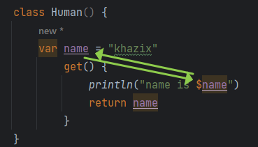

## Backing Field
실제로 데이터를 저장하고 있으나 외부에서 직접 수 없는 field. <br></br>
오로지 `get()` `set()` 메소드로만 컨트롤 할 수 있다.

Backing field includes initialized property with value.
Kotlin generates  `get()` and `set()` automatically declaring public variable using variable name

You must avoid use same variable name in `get()` and `set()` as shown below
```kotlin
class Human() {
    var name = "khazix"
        get() {
            // highlight-start
            println("name is $name")
            return name
            // highlight-end
        }
}
```
> ⚠️ This code throw `stackOverflowError` <br></br>
since call each other infinitely in `get()`




### How to solve this problem?
**Use Backing field with `field` keyword** instead of field name.


```kotlin
class Human() {
    var name = "khazix"
        get() {
            // `field` keyword stores the value of `name` property
            println("name is $field") 
            return field
        }
}
```

Backing field `field` keyword is used only in `get()` and `set()` method.


---
## Backing Property
외부로부터 접근 가능한 property 내부 동작은 Backing field 를 통해 구현한다.

### Without backing property
```kotlin
class CustomerWithoutBacking(val name: String) {
    val messages = mutableListOf<String>()

    fun addMessage(message: String) {
        this.messages.add(message)
    }
    
    @Test
    internal fun `load message without backing property`() {
        val customer = CustomerWithoutBacking("Karma")
        customer.addMessage("하나 둘 셋")
        // highlight-next-line
        customer.messages.clear() // Accidential deletion of data.
    }
}
```

## Backing property

```kotlin
class Customer(val name: String) {
    // Backing field
    private var _messages: MutableList<String>? = null

    // Backing Property
    val messages: MutableList<String>
        get() {
            if (_messages == null) {
                _messages = loadMessages()
            }
            return _messages!!
        }

    fun addMessage(message: String) {
        this.messages.add(message)
    }
    
    private fun loadMessages(): MutableList<String> =
        mutableListOf(
            "Initial Contact",
            "Convinced them to use kotlin",
            "Sold traning class. Sweet.",
        ).also { println("Loaded messages.") }
}
```

```kotlin
    @Test
    internal fun `load message`() {
        val customer = Customer("Falcon")
        customer.addMessage("NNNNNKKK")
        // Call also { println("Loaded messages.") }
        println(customer.messages) 
        customer.addMessage("Go Kotlin")
        // also statement is not called.
        println(customer.messages) 
    }
```


## Conclusion
Backing field support `get()` `set()` mechanism. <br></br>
You can set custom method with `field` keyword.

Backing property is used when want to do something that does not fit into this "implicit backing field" scheme. 

## Reference
- [Backing fields and property - kotlin docs](https://kotlinlang.org/docs/properties.html#backing-fields)
- [Backing fields](https://www.youtube.com/watch?v=H5TYt3ZlS0Q)